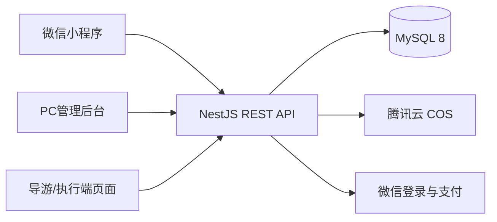

# 技术架构基线

## 总体结构

采用 TypeScript 单仓库、模块化单体和一套数据库。首期不引入微服务、Kubernetes、Redis、消息队列或复杂配置中心；出现真实并发和异步任务证据后再评估。

## 技术选择

| 层 | 选择 | 原因 |
| --- | --- | --- |
| 小程序 | uni-app + Vue 3 + TypeScript + Wot Design Uni | 与管理后台统一Vue技术，组件和微信端资料丰富 |
| 管理后台 | Vue 3 + Vite + TypeScript + Element Plus | 适合表格、配置和导出，使用成熟精简后台壳 |
| API | NestJS REST + OpenAPI | 模块边界清楚，适合共享TypeScript契约和自动测试 |
| 数据库 | MySQL 8 | 符合现有部署方向，事务和报表能力足够 |
| 文件 | 腾讯云COS | 图片和业务附件不占应用服务器及Git空间 |
| 部署 | Docker Compose + Nginx，必要时首期云托管 | 可在单机稳定运行，便于备份和回滚 |

## 首批后端模块

- `auth`：微信登录、后台登录和会话。
- `iam`：用户、角色、学校和团期数据范围。
- `organization`：学校、年级、班级。
- `catalog`：课程、产品、学校价格。
- `trip`：团期、报名时间和报名开关。
- `enrollment`：家庭成员、多人报名和协议版本留痕。
- `order`：付款人、联系人、参团人、订单明细和金额快照。
- `payment`：微信下单、回调、主动查询和退款记录。
- `roster`：已支付名单、教师导入和统计。
- `reporting`：Excel导出。
- `audit`：退款、权限和关键数据变更留痕。

## 从第一天固定的不变量

- 金额以整数“分”存储和计算，前端金额不作为结算依据。
- 付款人、消息联系人和实际参团人分开建模。
- 多人订单按参团人建立明细，部分退款不破坏其他人员状态。
- 支付成功以服务端验签回调或主动查询为准，客户端结果只作提示。
- 支付回调、退款请求和导入任务必须幂等。
- 正式参团名单默认只统计已支付且未完成退款的人员。
- 协议名称、版本、确认人和确认时间必须留痕。
- 所有导出接口执行与页面相同的数据权限检查。

## 外部服务适配

小程序名称、AppID、域名、商户号、证书路径和COS参数使用环境配置。开发期提供模拟支付实现，正式参数到位后替换为微信支付实现；业务订单状态不随支付供应商改变。
