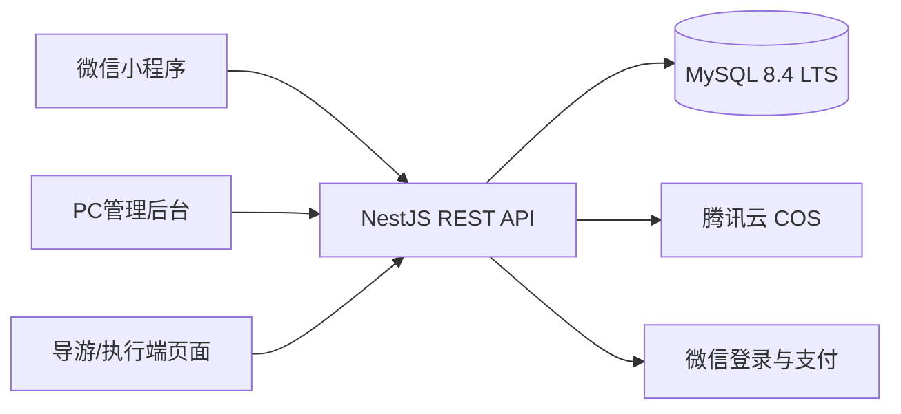

# 技术架构基线

## 总体结构

采用 TypeScript 单仓库、模块化单体和一套数据库。首期不引入微服务、Kubernetes、Redis、消息队列或复杂配置中心；出现真实并发和异步任务证据后再评估。

## 技术选择

| 层 | 选择 | 原因 |
| --- | --- | --- |
| 小程序 | uni-app + Vue 3 + TypeScript、项目自有组件与样式 | 使用 uni-app 基础组件与微信能力；当前未引入 Wot Design Uni |
| 管理后台 | Vue 3 + Vite + TypeScript + Element Plus | 适合表格、配置和导出，使用成熟精简后台壳 |
| API | NestJS REST + OpenAPI | 模块边界清楚，适合共享TypeScript契约和自动测试 |
| 数据库 | MySQL 8.4 LTS | 统一本地与腾讯云版本，事务和报表能力足够 |
| 文件 | 腾讯云COS | 图片和业务附件不占应用服务器及Git空间 |
| 部署 | 本地 UAT 使用 Docker Compose；当前云端使用 systemd + Nginx | 本地隔离验收与云端受控配置分开，按发布版本备份和回滚 |

## 后端模块

以下为核心链路模块；当前源码还包括行前、导游执行、健康授权、评价、保险、通知、影像、CRM 和归档，具体以 `apps/api/src/modules` 为准。

- `auth`：微信登录、后台登录和会话。
- `iam`：用户、角色、学校和团期数据范围。
- `organization`：学校、年级、班级。
- `catalog`：课程、产品、学校价格。
- `trip`：团期、报名时间和报名开关。
- `enrollment`：家庭成员、多人报名和协议版本留痕。
- `order`：付款人、联系人、参团人、订单明细和金额快照。
- `payment`：微信下单、回调、主动查询和退款记录。
- `roster`：已支付名单、教师导入和统计。
- `reporting`：Excel导出。
- `audit`：退款、权限和关键数据变更留痕。

## 从第一天固定的不变量

- 金额以整数“分”存储和计算，前端金额不作为结算依据。
- 付款人、消息联系人和实际参团人分开建模。
- 多人订单按参团人建立明细和金额快照；退款按明细分配整数分金额，不能仅按取消人数推算。部分退款不破坏其他人员状态。
- 支付成功以服务端验签回调或主动查询为准，客户端结果只作提示。
- 支付回调、退款请求和导入任务必须幂等。
- 正式参团名单默认只统计已支付且未完成退款的人员。
- 协议名称、版本、确认人和确认时间必须留痕。
- 所有导出接口执行与页面相同的数据权限检查。

## 外部服务适配

小程序名称、AppID、域名、商户号、商户API私钥、API v3密钥、微信支付公钥及公钥ID（账户仍使用平台证书模式时才配置平台证书）和COS参数使用环境配置。当前已接入真实微信登录及微信支付 API v3，模拟支付仅用于隔离开发测试，生产模式禁止开发身份头和模拟资金入口；业务订单状态不随支付供应商改变。订阅接口受理、保险登记和影像入口可用，分别仍需手机实收、保险方接收和真实上传/权限回执才能完成对应业务验收。
